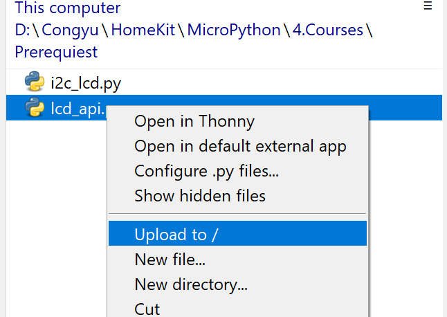

# Configuration on Ubuntu PC

### Step 1: Install Thonny

Run command: 

```bash
    sudo snap install thonny
```

### Step 2: Burn MicroPython Firmware to ESP32 to Enable Python on ESP32

Run command: 

```bash
    thonny
```

In the menu bar, you will see the `Run` panel.

    # Action: Click: (Menu) Run > Configure Interpreter

You will see two selection boxes.

    # Action: Select (1): MicroPython(ESP32)
    # Action: Select (2): USB-SERIAL@COMx
    # Action: Click: Install or Update MicroPython(***) 

You will see a menu button to the left of the `Install` button.

    # Action: Click: Menu button
    # Action: Click: Select local ***
    # Action: Navigate to: ./OpenELAB_HomeKit_Tutorial/Python/firmware/esp32-20210903-v1.17.bin
    # Action: Click: Install

Now you are done. It is highly recommended to open the file views.

    # Action: Click: (Menu) View > Files

## Step 3: Upload some libraries to the ESP32

Keep Thonny open, if not run command:

```bash
    thonny
```

In the file panel, navigate local folder to `./OpenELAB_HomeKit_Tutorial/Python/Courses/Prerequisites`

    # Action: Right-click: i2c_lcd.py
    # Action: Click: /upload_to

    # Action: Right-click: lcd_api.py
    # Action: Click: /upload_to
    
as shown:



## Step 4: Test code

    # Action: Plug-in: ESP32: PIN(12) --(Wire)-- LED

In the file panel, navigate local folder to `./OpenELAB_HomeKit_Tutorial/Python/Courses/Prerequisites`

Run `breathing_led.py`.


## Appendix

### Install CH340 Driver

```bash
    # (un-tested)
    cd ./Python/firmware/CH341SER_LINUX/driver
    sudo make
    sudo make load
    cd ..
    cd ..
    cd ..
    cd ..
```

### Alternative way to burn MicroPython Firmware 

First install esptool to burn the firmware.

```bash
    sudo apt install python3-pip
    pip3 install esptool
```

    # Action: Plug-in: PC --(USB-Type C Cable)-- ESP32 Board

Then find the location of the device.

```bash
    ls /dev/ttyUSB*   # note the location, eg. /dev/ttyUSB0
```
    
Burn the firmware to the location(eg. `/dev/ttyUSB0`).

```bash
    # (un-tested)
    # assuming you are in ./OpenELAB-HomeKit, if not, navigate to there
    sudo esptool.py --chip esp32 --port /dev/ttyUSB0 --baud 460800 write_flash -z 0x1000 ./Python/firmware/esp32-20210902-v1.17.bin
```

Open the Thonny, we are going to set ESP32 Board as the interpreter.

    # Action: Press: Win button on your PC
    # Action: Type: thonny
    # Action: Type: Enter Button (when you see Thonny app)

In the menu bar, you will see the `Run` panel.
    
    # (un-tested)
    # Action: Click: (Menu) Tools > Options > interpreter
    # Action: Select: MicroPython(ESP32)

Now you are done. It is highly recommended to open the file views.

    # Action: Click: (Menu) View > Files