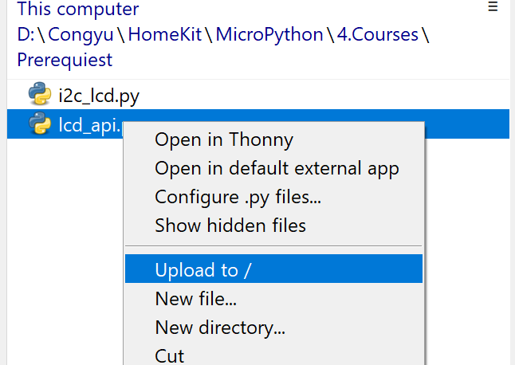

# Configuration on MacOS (un-tested)

### Step 1: Update the Driver to Communicate with the ESP32 Board

    # Action: Navigate.to: ./OpenELAB_HomeKit_Tutorial/Python/firmware/CH34x_Install_V1.5.pkg
    # Action: Double-click: CH34x_Install_V1.5.pkg

Then follow the instructions to finish the installation.

### Step 2: Burn MicroPython Firmware to ESP32 to Enable Python on ESP32

    # Actions: Download Thonny from: https://github.com/thonny/thonny/releases/download/v4.1.6/thonny-4.1.6.pkg
    # Action: Double-click: Downloads/CH34x_Install_V1.5.pkg

Then follow the instructions to finish the installation.

    # Action: Open the Thonny App.    

In the menu bar, you will see the `Run` panel.

    # Action: Click: (Menu) Run > Configure Interpreter

You will see two selection boxes.

    # Action: Select (1): MicroPython(ESP32)
    # Action: Select (2): USB-SERIAL@COMx
    # Action: Click: Install or Update MicroPython(***) 

You will see a menu button to the left of the `Install` button.

    # Action: Click: Menu button
    # Action: Click: Select local ***
    # Action: Navigate to: ./OpenELAB_HomeKit_Tutorial/Python/firmware/esp32-20210903-v1.17.bin
    # Action: Click: Install

Now you are done. It is highly recommended to open the file views.

    # Action: Click: (Menu) View > Files


## Step 3: Upload some libraries to the ESP32

Keep Thonny open, if not run command:

```bash
    thonny
```

In the file panel, navigate local folder to `./OpenELAB_HomeKit_Tutorial/Python/Courses/Prerequisites`

    # Action: Right-click: i2c_lcd.py
    # Action: Click: /upload_to

    # Action: Right-click: lcd_api.py
    # Action: Click: /upload_to

    # Action: Right-click: io_map.py
    # Action: Click: /upload_to
    
as shown:



## Step 4: Test code

    # Action: Plug-in: ESP32: PIN(12) --(Wire)-- LED

In the file panel, navigate local folder to `./OpenELAB_HomeKit_Tutorial/Python/Courses/Prerequisites`

Run `breathing_led.py`.
