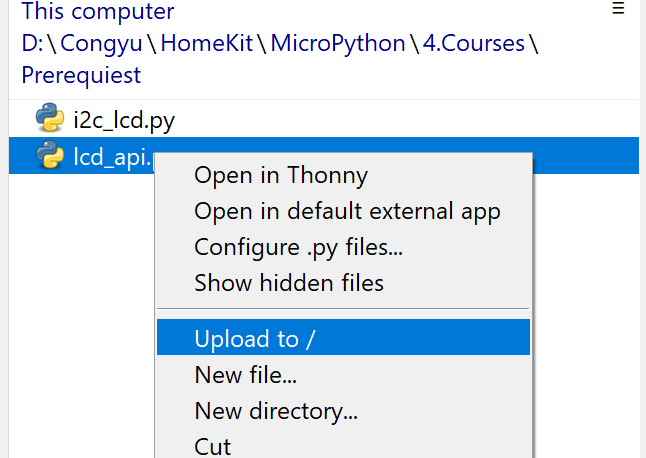

# Configuration on Windows PC

### Step 1: Update the Driver to Communicate with the ESP32 Board

    # Action: Plug-in: PC --(USB-Type C Cable)-- ESP32 Board
    # Action: Press: Win button on your PC
    # Action: Type: 'device'

You will see a `Device Manager` pop-up.

    # Action: Click: Device Manager

You will see a list of devices, find something like `***(COM & ***)`.

    # Action: Click: the ">" button before '***(COM & ***)'
    # Action: Right-click: USB-SERIAL CH340 (COM*)
    # Action: Click: Update driver
    # Action: Click: Browse ***
    # Action: Click: Browse
    # Action: Navigate to: ./OpenELAB_HomeKit_Tutorial/Python/firmware/usb_ch341_3.1.2009.06
    # Action: Click: Next

Then finish the installation.

### Step 2: Burn MicroPython Firmware to ESP32 to Enable Python on ESP32

We are going to use **Thonny** as the Python editor.  
Thonny is directly executable as a `.exe` file within the folder, so we do not need to do anything here.

    # Action: Navigate to: ./OpenELAB_HomeKit_Tutorial/Python/firmware/Thonny
    # Action: Double-click: Thonny.exe

In the menu bar, you will see the `Run` panel.

    # Action: Click: (Menu) Run > Configure Interpreter

You will see two selection boxes.

    # Action: Select (1): MicroPython(ESP32)
    # Action: Select (2): USB-SERIAL@COMx
    # Action: Click: Install or Update MicroPython(***) 

You will see a menu button to the left of the `Install` button.

    # Action: Click: Menu button
    # Action: Click: Select local ***
    # Action: Navigate to: ./OpenELAB_HomeKit_Tutorial/Python/firmware/esp32-20210903-v1.17.bin
    # Action: Click: Install

Now you are done. It is highly recommended to open the file views.

    # Action: Click: (Menu) View > Files


## Step 3: Upload some libraries to the ESP32

Keep Thonny open, if not run command:

```bash
    thonny
```

In the file panel, navigate local folder to `./OpenELAB_HomeKit_Tutorial/Python/Courses/Prerequisites`

    # Action: Right-click: i2c_lcd.py
    # Action: Click: /upload_to

    # Action: Right-click: lcd_api.py
    # Action: Click: /upload_to

    # Action: Right-click: io_map.py
    # Action: Click: /upload_to
    
as shown:



## Step 4: Test code

    # Action: Plug-in: ESP32: PIN(18) --(Wire)-- LED

In the file panel, navigate local folder to `./OpenELAB_HomeKit_Tutorial/Python/Courses/Prerequisites`

Run `breathing_led.py`.

